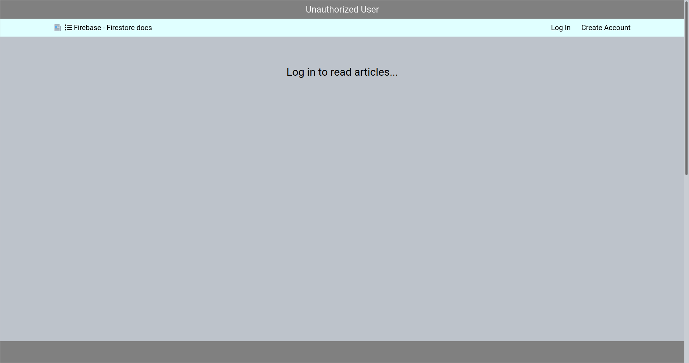

# Firebase-DB

Database (Firestore) application built on the Front-End course.

Link to the application: [https://test-proj-gda2.web.app/](https://test-proj-gda2.web.app/)

## Description

Firestore database application - after creating an account, you can log in and add / read an article.

## Notes/ ToDo List/ Issues

1. Less to CSS compilation takes place in the browser.

## ScreenShots

## Built With

- [Firebase JavaScript SDK](https://firebase.google.com/docs/reference/js) - SDK of Firestore,
- [LESS](https://lesscss.org/) - Stylesheet/less.

## License

[MIT](https://choosealicense.com/licenses/mit/)
